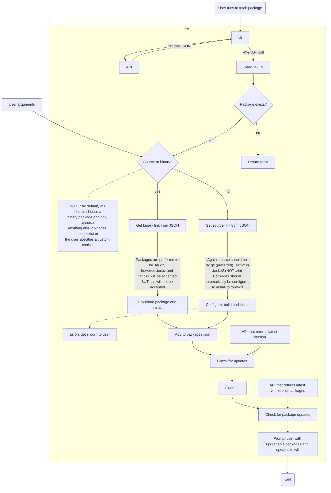

# will

A package manager that *willingly* installs your packages.

Written using Rust (yes i'm learning it)

How a typical install *should* work:

```mermaid
flowchart TD
    user(User tries to fetch package) --> cli
    args[User arguments] --> sourceOrBinary
    subgraph ide1 [will]
        cli[cli] --> api[API]
        api --> |returns JSON|cli
        cli --> |After API call|readJson[Read JSON]
        readJson --> exists{Package exists?}
        exists --> |no|err1[Return error]
        exists --> |yes|sourceOrBinary{Source or binary?}
        sourceOrBinary -.- sourceOrBinaryNote[NOTE: by default, will should choose a\nbinary package and only choose\nanything else if binaries don't exist or\nthe user specifies a custom choice.]
        sourceOrBinary --> |yes|binLink[Get binary link from JSON]
        sourceOrBinary --> |no|sourceLink[Get source link from JSON]
        binLink --> |Packages are preferred to be .tar.gz, \nhowever .tar.xz and .tar.bz2 will be accepted \nBUT .zip will not be accepted|download[Download package and install]
        sourceLink --> |"`Again, source should be .tar.gz (preferred), .tar.xz or .tar.bz2 (NOT .zip) Packages should automatically be configured to install to /opt/will`"|configure[Configure, build and install]
        configure -.-> error[Errors get shown to user]
        download --> addtoDB[Add to packages.json]
        configure --> addtoDB
        addtoDB --> updates[Check for updates]
        updateAPI[API that returns latest version] --> updates
        updates --> clean[Clean up]
        clean --> packageUpdates[Check for package updates]
        packageAPI[API that returns latest versions of packages] --> packageUpdates
        packageUpdates --> prompt[Prompt user with upgradable packages and updates to will]
    end
    prompt --> End(End)
```
